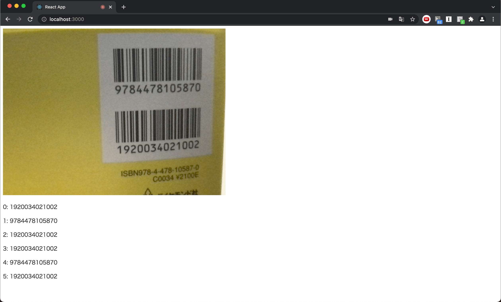

# sample-react-app-barcode-reader

[zxing](https://github.com/zxing-js/browser)を利用したバーコードリーダー機能を有するwebアプリ



## setup && start

```bash
git clone https://github.com/akira393/sample-app-barcode-reader.git
cd sample-app-barcode-reader
npm install
npm run start
```
